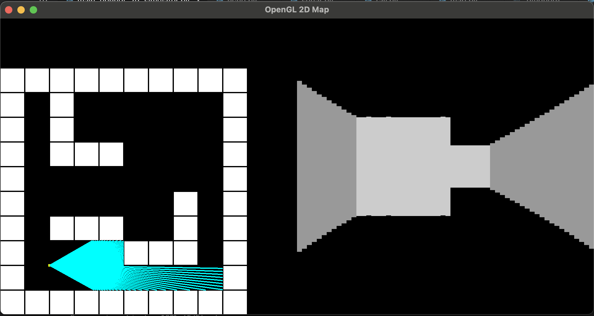

# PyOpenGL Raycasting 

This project is a basic raycasting example for a 2D top-down map, with a player controlled via the arrow keys. The player can rotate left and right, move forward and backward, while rays are cast to simulate the player's view. The project uses OpenGL for rendering and GLFW for window management and input handling.



## Controls

- **Up Arrow**: Move forward
- **Down Arrow**: Move backward
- **Left Arrow**: Rotate left
- **Right Arrow**: Rotate right

## Project Structure

- `main_opengl_2d_simulation.py`: The main entry point for the application. Initializes the window, sets up the map and player, and runs the main rendering loop.
- `player.py`: Defines the `Player` class, which handles player movement, rotation, collision detection, and rendering the player on the 2D map.
- `map.py`: Defines the `Map` class, which holds the 2D grid structure of the map and renders the map to the screen.
- `ray.py`: Defines the `Ray` class, which casts rays from the player's position to simulate vision and detects intersections with walls.

## How It Works

1. **Raycasting**: Rays are cast in a fan pattern from the player's position (fov is defined in the code), and the intersection points with walls are calculated. These distances are used to render the 3D-like effect in 2D space.
2. **Player Movement**: The player can rotate left and right to adjust their field of view. Moving forward and backward changes the player's position on the map.
3. **Map Rendering**: The map is a 2D grid, where walls and open spaces are defined. Walls are represented by "1" and empty spaces by "0".

## Running the Project

1. Install the dependencies:
    ```bash
    pip install -r requirements.txt
    ```

2. Run the project:
    ```bash
    python main_opengl_2d_simulation.py
    ```